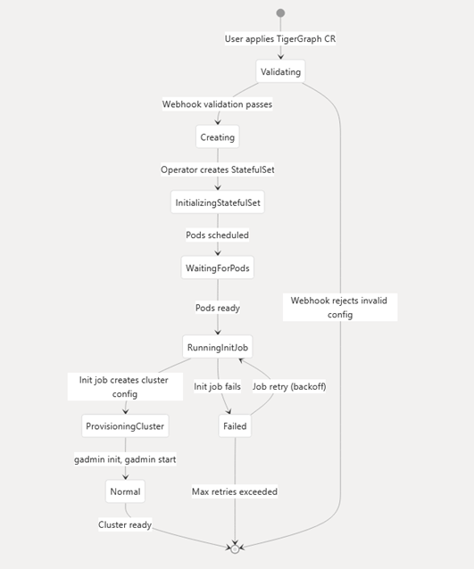
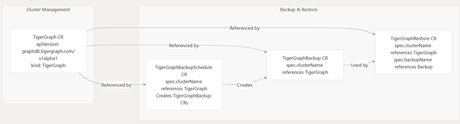

# TigerGraph Kubernetes Operator — Deployment & Evaluation

> Deploying **TigerGraph v4.1.3** on Kubernetes using the official [TigerGraph K8s Operator](https://github.com/tigergraph/ecosys/tree/master/k8s), including fault-tolerance analysis, unit tests, and a Docker-based pipeline.

---

## Table of Contents

- [Overview](#overview)
- [Architecture](#architecture)
- [Prerequisites](#prerequisites)
- [Environment Variables](#environment-variables)
- [Quick Start](#quick-start)
- [Docker Pipeline](#docker-pipeline)
- [Running Unit Tests](#running-unit-tests)
- [Fault Tolerance](#fault-tolerance)
- [Challenges & Solutions](#challenges--solutions)
- [Screenshots](#screenshots)
- [Project Structure](#project-structure)
- [References](#references)

---

## Overview

This project evaluates the TigerGraph Kubernetes Operator by deploying a production-style TigerGraph 4.1.3 cluster on Kubernetes. It covers:

- Full cluster lifecycle management via a `TigerGraphCluster` custom resource (CRD)
- Automated reconciliation using the operator pattern
- Persistent storage, health probes, and self-healing
- A unit test suite validating operator behavior
- A Docker Compose pipeline for local development

---

## Architecture


```
┌─────────────────────────────────────────────────────────┐
│                   Kubernetes Cluster                    │
│                                                         │
│  ┌─────────────────────┐    ┌────────────────────────┐  │
│  │  TigerGraph Operator │    │  TigerGraphCluster CRD │  │
│  │  (Deployment)        │───▶│  (Custom Resource)     │  │
│  └─────────────────────┘    └────────────────────────┘  │
│            │                                            │
│            ▼                                            │
│  ┌─────────────────────────────────────────────────┐    │
│  │              StatefulSet: tg-cluster            │    │
│  │  ┌──────────┐  ┌──────────┐  ┌──────────┐      │    │
│  │  │tg-cluster│  │tg-cluster│  │tg-cluster│      │    │
│  │  │    -0    │  │    -1    │  │    -2    │      │    │
│  │  └────┬─────┘  └────┬─────┘  └────┬─────┘      │    │
│  │       │              │              │            │    │
│  │  ┌────▼──┐      ┌────▼──┐     ┌────▼──┐         │    │
│  │  │  PVC  │      │  PVC  │     │  PVC  │         │    │
│  │  └───────┘      └───────┘     └───────┘         │    │
│  └─────────────────────────────────────────────────┘    │
│            │                                            │
│     ┌──────┴──────┐                                     │
│     ▼             ▼                                     │
│  Headless      External                                 │
│  Service       Service                                  │
│  (internal)    (RESTPP :9000 / GraphStudio :14240)      │
└─────────────────────────────────────────────────────────┘
```

| Component | Type | Purpose |
|---|---|---|
| `tigergraph-operator` | Deployment | Operator controller — watches CRD, reconciles state |
| `TigerGraphCluster` | CRD | Custom resource defining the cluster spec |
| `tg-cluster-0..N` | StatefulSet Pods | TigerGraph GSQL / GPE / GSE / RESTPP / GUI |
| `tg-cluster-headless` | Headless Service | Stable DNS for pod-to-pod communication |
| `tg-cluster-restpp-svc` | Service | External RESTPP API access on port 9000 |
| `tg-cluster-nginx-svc` | Service | GraphStudio web UI on port 14240 |
| `tg-data-<n>` | PersistentVolumeClaim | Durable graph data storage per pod |
| `tg-license` | Secret | TigerGraph license key (encrypted at rest) |

---

## Custom Resource Relationships

---

## Prerequisites

| Tool | Min Version | Purpose |
|---|---|---|
| `kubectl` | 1.24+ | Kubernetes CLI |
| `Helm` | 3.10+ | Operator installation |
| `Docker` | 20.10+ | Container runtime |
| `Go` | 1.21+ | Unit test execution |
| Kubernetes cluster | 1.31 | EKS |
| TigerGraph license | valid key | Required for cluster initialization |
| `TigerGraph Operator` | 1.6.0 | TigerGraph operator for reconciliation
| `TigerGraph Cluster client` | 4.1.3 | TigerGraph CR to create Statefulset TigerGraph DB
---

## Environment Variables

Create a `.env` file in the project root or export these before deploying:

```bash
# Required
export TG_VERSION=4.1.3                         # TigerGraph version
export TG_LICENSE="<your-one-line-license-key>" # License key (must be a single line)

# Optional — defaults shown
maxConcurrentReconcilesOfTG 4   
maxConcurrentReconcilesOfBackup 2  
maxConcurrentReconcilesOfBackupSchedule 2  
maxConcurrentReconcilesOfRestore 2  
```

---

## Quick Start

### 1. Clone the repository

```bash
git clone https://github.com/somasundar-kapaka/agivant-tigergraph-assignment.git
cd ecosys/k8s
```

### 2. Create namespace

```bash
kubectl create namespace tigergraph
```

### 3. Install the operator

```bash
kubectl apply -f deploy
kubectl get pods -n tigergraph -w   # wait for operator pod to reach Running
```

### 4. Store the license key

```bash
LICENSE=$(tr -d '\n' < license.txt)   # strip any accidental newlines
kubectl create secret generic tg-license \
  --from-literal=license="$LICENSE" \
  -n tigergraph
```

### 5. Deploy the TigerGraph cluster

```bash
kubectl apply -f - <<EOF
apiVersion: graphdb.tigergraph.com/v1alpha1
kind: TigerGraph
metadata:
  name: test-cluster
  namespace: tigergraph
spec:
  image: docker.io/tigergraph/tigergraph-k8s:4.1.3
  imagePullPolicy: IfNotPresent
  ha: 1
  listener:
    type: LoadBalancer
  privateKeyName: ssh-key-secret
  replicas: 1 
  licenseSecretName: tigergraph-license
  resources:
    requests:
      cpu: "2"
      memory: 4Gi
    limits:
      cpu: "4"
      memory: 8Gi

  storage:
    type: persistent-claim
    volumeClaimTemplate:
      resources:
        requests:
          storage: 100G
      storageClassName: gp3-wait
EOF
```

### 6. Verify the deployment

```bash
# Watch all pods reach Running/Ready
kubectl get pods -n tigergraph -w

# Check CR status
kubectl get tigergraphcluster test-cluster -n tigergraph -o yaml | grep -A5 status

# Confirm PVCs are Bound
kubectl get pvc -n tigergraph

# Confirm services exist
kubectl get svc -n tigergraph
```

### 7. Access TigerGraph

```bash
# RESTPP API
kubectl port-forward svc/tg-cluster-restpp-svc 9000:9000 -n tigergraph &
curl http://localhost:9000/restpp/ping
# Expected: {"error":false,"message":"pong","results":[]}

# GraphStudio Web UI
kubectl port-forward svc/tg-cluster-nginx-svc 14240:14240 -n tigergraph &
open http://localhost:14240

# GSQL Shell
kubectl exec -it tg-cluster-0 -n tigergraph -- /home/tigergraph/tigergraph/app/cmd/gsql
```

---

## Docker Pipeline

For local development and CI without a full K8s cluster:

```bash
# Build the operator image
docker build -t tigergraph-operator:dev ./operator

# Start the full stack (TigerGraph + mock infrastructure)
docker-compose up -d

# Run unit tests inside the container
docker run --rm tigergraph-operator:dev go test ./... -v

# Tear down
docker-compose down -v
```

### Resource limits (`docker-compose.yml`)

```yaml
services:
  tigergraph:
    image: tigergraph/tigergraph-k8s:4.1.3
    deploy:
      resources:
        limits:
          cpus: '4.0'
          memory: 16G
        reservations:
          cpus: '2.0'
          memory: 8G
    environment:
      - TG_LICENSE=${TG_LICENSE}
      - TG_VERSION=4.1.3
    volumes:
      - tg-data:/home/tigergraph/tigergraph/data
    ports:
      - "9000:9000"   # RESTPP
      - "14240:14240" # GraphStudio

volumes:
  tg-data:
```

---

## Running Unit Tests

The test suite is in `controllers/operator_test.go` and uses `controller-runtime`'s fake client — no live cluster needed.

```bash
# Run all tests
go test ./controllers/... -v 
```

## Fault Tolerance

### What Kubernetes adds beyond bare-metal TigerGraph

| Feature | Bare Metal | Kubernetes |
|---|---|---|
| Process restart | Manual / systemd | Automatic via `restartPolicy` + liveness probes |
| Node failure recovery | Manual server replacement | Pod rescheduled automatically by StatefulSet controller |
| Data persistence | RAID / NAS | PVC survives pod deletion and node reschedule |
| Health monitoring | Custom scripts | Built-in readiness + liveness probes |
| Rolling upgrades | Manual | Zero-downtime `RollingUpdate` strategy on StatefulSet |
| Topology spread | Manual placement docs | Pod anti-affinity rules enforced by scheduler |
| Secret management | Files on disk | Encrypted K8s Secrets with RBAC |
| Horizontal scaling | Manual node add + config | Single CR `replicas` field change |
| Operator HA | None | Leader election across multiple operator replicas |

### Verifying self-healing

```bash
# Terminal 1 — watch pods
kubectl get pods -n tigergraph -w

# Terminal 2 — simulate a pod failure
kubectl delete pod tg-cluster-0 -n tigergraph
```

Expected: `tg-cluster-0` transitions to `Terminating`, then a new pod is created and returns to `1/1 Running` within ~2 minutes — no manual intervention required.

### production additions

```yaml
# PodDisruptionBudget — prevents full cluster downtime during node drains
apiVersion: policy/v1
kind: PodDisruptionBudget
metadata:
  name: tg-cluster-pdb
  namespace: tigergraph
spec:
  minAvailable: 2
  selector:
    matchLabels:
      app: tigergraph

# Pod anti-affinity — spreads pods across availability zones
affinity:
  podAntiAffinity:
    requiredDuringSchedulingIgnoredDuringExecution:
    - labelSelector:
        matchLabels:
          app: tigergraph
      topologyKey: topology.kubernetes.io/zone
```

---

## Challenges & Solutions

| # | Challenge | Solution |
|---|---|---|
| 1 | License key rejected at init — invisible newlines from email copy-paste | `tr -d '\n' < license.txt` to sanitize before creating the K8s Secret |
| 2 | PVCs stuck in `Pending` — no default StorageClass in kind | Patched `standard` StorageClass to be the default |
| 3 | Operator pod `CrashLoopBackOff` — missing RBAC permissions | Applied bundled `rbac.yaml`; inspected exact error with `kubectl logs` |
| 4 | Init containers timing out — slow image pull in kind | Pre-pulled image with `docker pull` then `kind load docker-image` |
| 5 | All pods on same worker node — no anti-affinity by default | Added `podAntiAffinity` to CR spec manually |
| 6 | Pods stuck at `0/1 Ready` — readiness probe failing during startup | Increased `initialDelaySeconds` from 30 → 120 |


---

## Screenshots

The following screenshots should be captured and attached to your submission:

| # | What to Capture | Command |
|---|---|---|
| 1 | K8s nodes Ready | `kubectl get nodes` |
| 2 | Namespace created | `kubectl get namespaces` |
| 3 | Operator pod Running + CRDs registered | `kubectl get pods -n tigergraph` + `kubectl get crds` |
| 4 | License secret created | `kubectl get secrets -n tigergraph` |
| 5 | TigerGraphCluster CR applied | CR apply output |
| 6 | Pods initializing (Pending / Init) | `kubectl get pods -n tigergraph -w` (early phase) |
| **7** | **All pods Running/Ready** | **`kubectl get pods -n tigergraph` — all `1/1 Ready`** |
| 8 | StatefulSet details (image 4.1.3, limits) | `kubectl describe statefulset test-cluster -n tigergraph` |
| 9 | PVCs Bound | `kubectl get pvc -n tigergraph` |
| 10 | CR status: Ready | `kubectl get tigergraphcluster -o yaml` |
| 11 | Services created | `kubectl get svc -n tigergraph` |
| 12 | GraphStudio Web UI | Browser at `http://13.201.115.5:30459` |
| **13** | **Pod self-healing** | **`kubectl delete pod tg-cluster-0` then watch recovery** |
| 14 | Cluster events log | `kubectl get events -n tigergraph` |
| 15 | Operator reconcile logs | `kubectl logs deploy/tigergraph-operator-controller-manager -n tigergraph` |
| **16** | **Unit tests passing** | **`go test ./controllers/... -v`** |
| 17 | Resource usage (bonus) | `kubectl top pods -n tigergraph` |

---

## Project Structure

```
agivant-tigergraph-assignment/
├── controllers/
│   ├── test_func.go  # Operator reconciliation logic
│   ├── tigergraph_test.go  unit-test file
│   └── types.go                 # Unit test suite (18 tests)
├── deploy/
│   ├── operator.yaml                    # CRDs operator Deployment
├── go.mod
└── README.md                            # This file
```

---
## Project testing
Run `go test ./controllers -v`

---
## References

- [TigerGraph K8s Operator Source](https://github.com/tigergraph/ecosys/tree/master/k8s)
- [TigerGraph Documentation](https://docs.tigergraph.com)
- [Kubernetes StatefulSets](https://kubernetes.io/docs/concepts/workloads/controllers/statefulset/)
- [Kubernetes Operator Pattern](https://kubernetes.io/docs/concepts/extend-kubernetes/operator/)
- [controller-runtime](https://github.com/kubernetes-sigs/controller-runtime)
- [TigerGraph Docker Hub](https://hub.docker.com/r/tigergraph/tigergraph-k8s)

---

*TigerGraph v4.1.3 · Kubernetes Operator · April 2026*